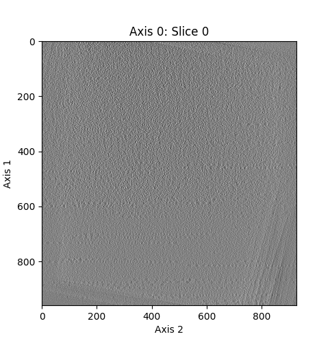

`visualize_voxels` contains the function `visualize`, which allows for fast, easy visualization of 3D grayscale voxel images stored in the form of a 3D array of values.

Simply calling `visualize(data)` where `data` is a 3D numpy array (`run_6355.mrc`, see the Demo heading below) containing nearly 500 million voxels yields this visualization in a few seconds:


More is possible by setting keyword arguments. Here is the same array visualized at a higher frame rate through a different axis with a helix plotted in red within the volume:


Here the array is visualized with a bounding box around the bacteria in the image:



Because this uses `matplotlib`'s animations as a backend, the visualizations can be interacted with in Jupyter notebooks.

See the Demo heading below for more information about the demo notebook, which includes the code that produced the above images, as well as more examples.

# Installation
To install, use pip:
```shell
pip install git+https://github.com/mward19/visualize_voxels.git

```

# Usage
This package exports just one function: `visualize`.

Use the `visualize` function on a 3D image array in a script or Jupyter notebook to visualize it:

```python
from visualize_voxels import visualize
import numpy as np

number_generator = np.random.default_rng()
array_to_visualize = number_generator.normal(size=(100, 100, 100))

visualize(array_to_visualize)
```

`visualize` has many arguments to customize the display, plot points, and save the resulting visualization. 

```python
def visualize(
        array, 
        filename=None,
        *, 
        title=None,
        scale=1.0,          # Scale image size
        slices=50,          # If int, number of slices to display. If list, slices to display.
        fps=10.,            # Frames per second
        axis=0,             # Axis to slice over
        marks=[],           # List of 3D tuples to mark
        marksize=75,        # Size of marks in pixels
        markalpha=1,
        imodmode=False,
        showaxes=True,
        minval=None,
        maxval=None
    ):
    """
    Yields a notebook visualization of a 3D array `array` as an animation using FuncAnimation.

    Args:
        array (nparray): 
            The array to visualize
        filename (string): 
            If set, saves the displayed animation as `filename`.
    Keyword args:
        title (string):
            A title for the plot
        scale (float or int): 
            Scales the image size.
        slices (int or iterable of ints): 
            Number of slices or list of slices to display.
        fps (int): 
            Frames per second of the displayed animation
        axis (int): 
            The axis to slice over
        marks (list of 3-element indexables): 
            Points to mark in red
        marksize (float or int): 
            size of marks
        markalpha (float):
            transparency of marks
        showaxes (bool)
            If True, displays all three axes.
        imodmode (bool): 
            If set, displays axes how IMOD does (Z Y X). Defaults to False
        minval (float):
            The value of the darkest pixel. Defaults to the min of array
        maxval (float):
            The value of the brightest pixel. Defaults to the max of array
    """
```

See `demo_visualize.ipynb` for examples. 

# Demo
The example data `run_6355.mrc` used in the included demo notebook `demo_visualize.ipynb` and on this README can be found at [the CryoET Data Portal](https://cryoetdataportal.czscience.com/runs/6355).
Download the exact file [here](https://cryoetdataportal.czscience.com/runs/6355?download-step=download&download-config=tomogram&tomogram-sampling=10.4&tomogram-processing=raw&file-format=mrc&download-tab=download). (Note: the filename defaults to `dga2019-05-28-162.mrc`.) The demo notebook relies on the python library `mrcfile` to read `run_6355.mrc`, as well as `skimage`, which can both be installed with `pip`: 

```shell
pip install mrcfile scikit-image
```
